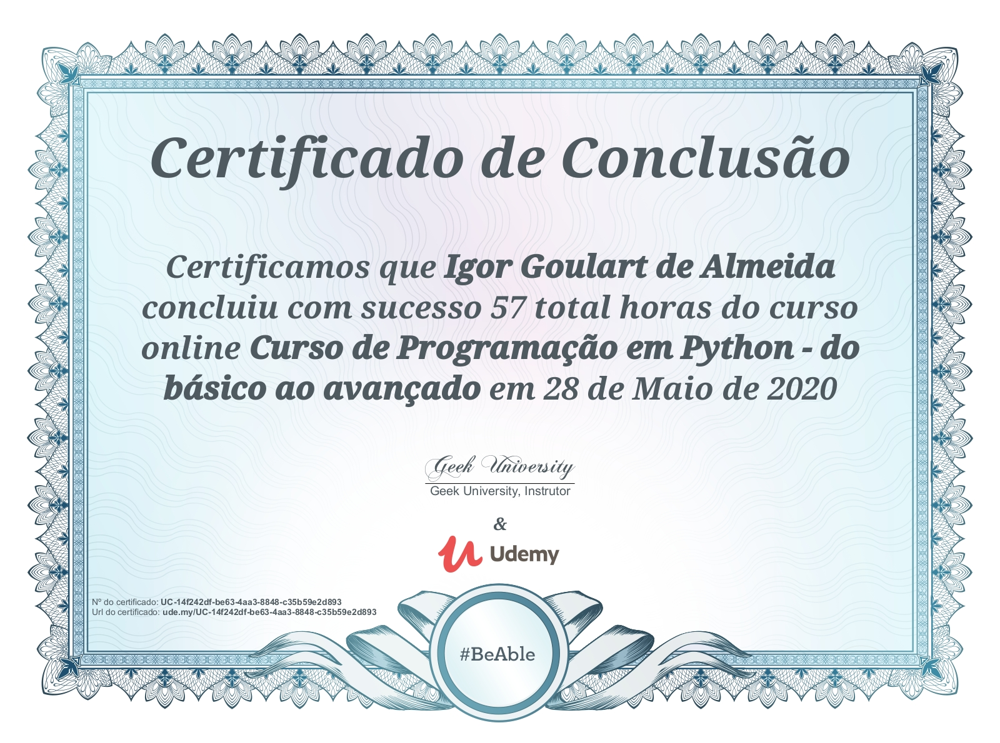

# curso-de-python-essencial
> Meus arquivos do curso de programação em Python da [Geek University](https://www.geekuniversity.com.br/) - do básico ao avançado, com duração total de 57 horas.

## Tópicos Abordados

- Variáveis e Tipos de Dados;
- Estruturas Lógicas e Condicionais;
- Estruturas de Decisão e Repetição;
- Coleções (Listas, Tuplas, Sets, etc);
- Funções;
- Expressões Lambdas;
- Debugar seu código e tratar erros;
- Módulos;
- Leitura e Escrita em arquivos;
- Iteradores e Geradores;
- Decorators;
- Orientação a Objetos;
- Herança e Polimorfismo;
- Manipulação de Arquivos CSV e JSON;
- Data e Horas;
- Testes;
- Alocação e Gerenciamento de Memória;
